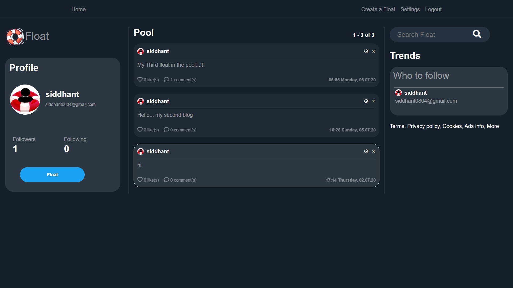
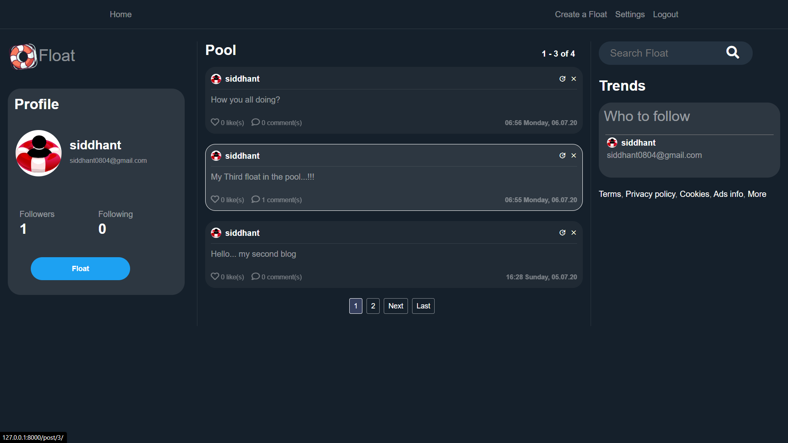

# Django Web Project - Float by Siddhant Pandya

A Django based project to share your work, ideas etc on web platform and get inspired by others, a community dedicated to grow and improve ones skills.

## Setup

1. Git Clone the project with: ```git clone https://github.com/siddhant-pandya/Float.git```.

2. Move to the base directory: ```cd Float```

3. Create a new python enveronment with: ```python -m venv env```.

4. Activate enveronment with: ```env\Scripts\activate``` on windows, or ```source env/bin/activate``` on Mac and Linux.

5. Install required dependences with: ```pip install -r requirements.txt```.

6. Make migrations with: ```python manage.py makemigrations``` and then ```python manage.py migrate```.

7. Run app localy with: ```python manage.py runserver```.

## Demo Images
Image 1:

Image 2:
